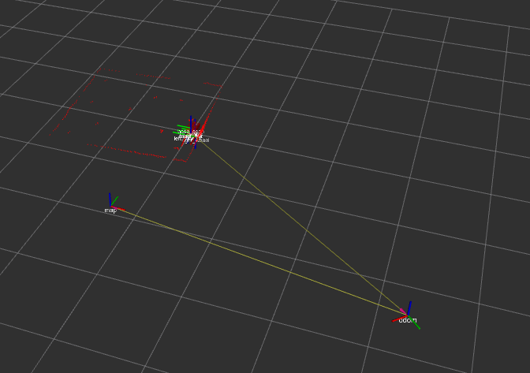
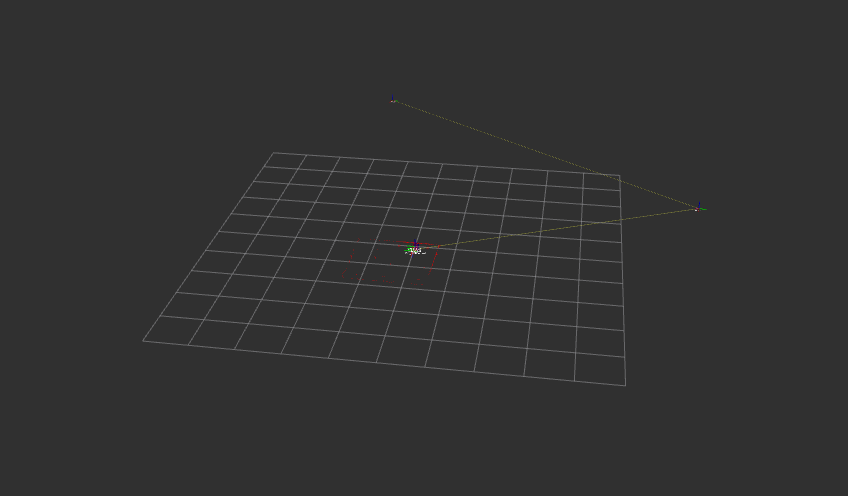

## SLAM UNDER CONTROLLED SETTINGS (KNOWN DATA ASSOCIATION)
Pose error odometry
1. x - 2.78
2. y - 3.5
3. theta - 2.14

Pose error SLAM (controlled setting - known data association)
1. x - 0.01
2. y - -0.02
3. theta - -0.03

rviz results for slam under controlled settings

## SLAM WITH UNKNOWN DATA ASSOCIATION
Pose error odometry
1. x - -1.34
2. y - 2.35
3. theta - -1.56
 
Pose error slam (values fluctuate. Algorithm doesn't give desired results)
1. x - 9.56
2. y - -2.46
3. theta - 1.3

rviz results for slam with unknown data association

 

