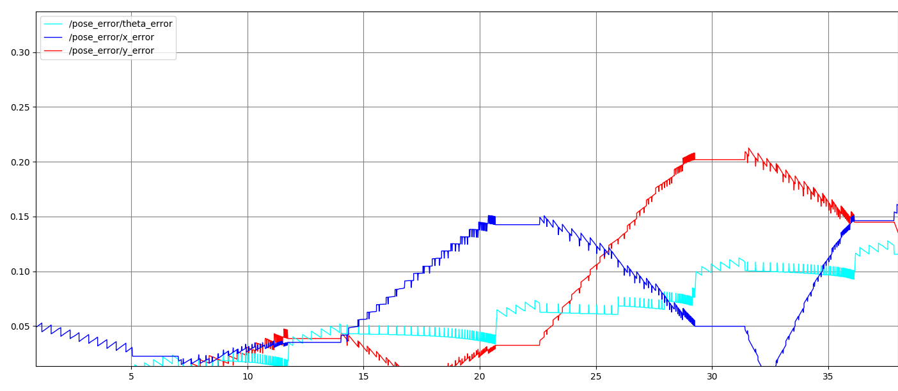
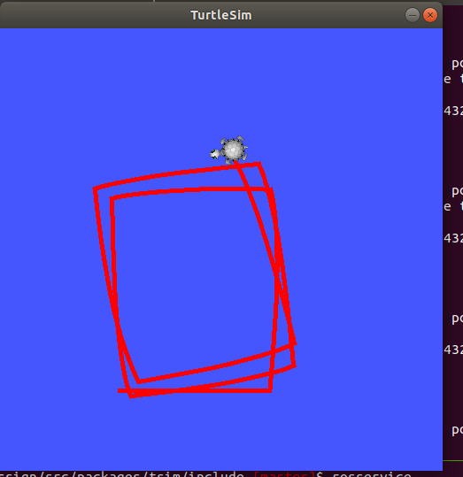
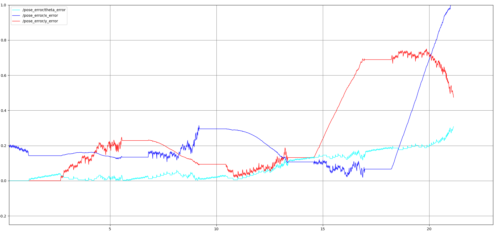

## Package Description ##
This package contains code for controlling a turtle from turtlesim package
through a feed forward control.

 
##  roslaunch command ##
1. `roslaunch tsim trect.launch`
2. `roslaunch tsim turtle_pent.launch`
3. `roslaunch tsim turtle_odom.launch` 

## Files ##
1. turtle_rect.cpp - The main logic file which holds code for setting up the
                     RoS communications and controlling the turtle
2. turtle_rect.hpp - The header file of the above cpp file. Contains the class
                     definition for that controls the whole pipeline
3. trect.launch - The launch file which launches the turtlesim node and the  
                  turtle_rect node. This also holds parameters that specify
                  the rectangular motion of the turtle.
4. ErrorPose.msg - A custom message definition for storing and publishing the
                   error pose ( Difference between the turtle's belief and 
                   the actual pose)
5. turtle_way.hpp - The header file for the implementation which makes the
                    turtle follow a sequence of way points given
6. turtle_way.cpp - The cpp file implementing functionalities for making the
                    turtle follow a sequence of waypoints
7. turtle_pent.launch - The launch file which launches turtle_way node and makes
                        the turtle follow a pentagonal path
8. turtle_odom.launch - The launch which makes the turtle follow a pentagonal path
                        as well use this velocity to encode a fake encoder for
                        a differential drive robot and make it move along the
                        same path
                  
## Outputs ##
1. rqt graph output of the turtle following pentagon path 

2. Screenshot of turtle 

3. rqt graph output 

4. [Link to video output](https://drive.google.com/file/d/1CjJGAg3pz2uSBVpcFEVQs__nyGiVkVnt/view?usp=sharing)
